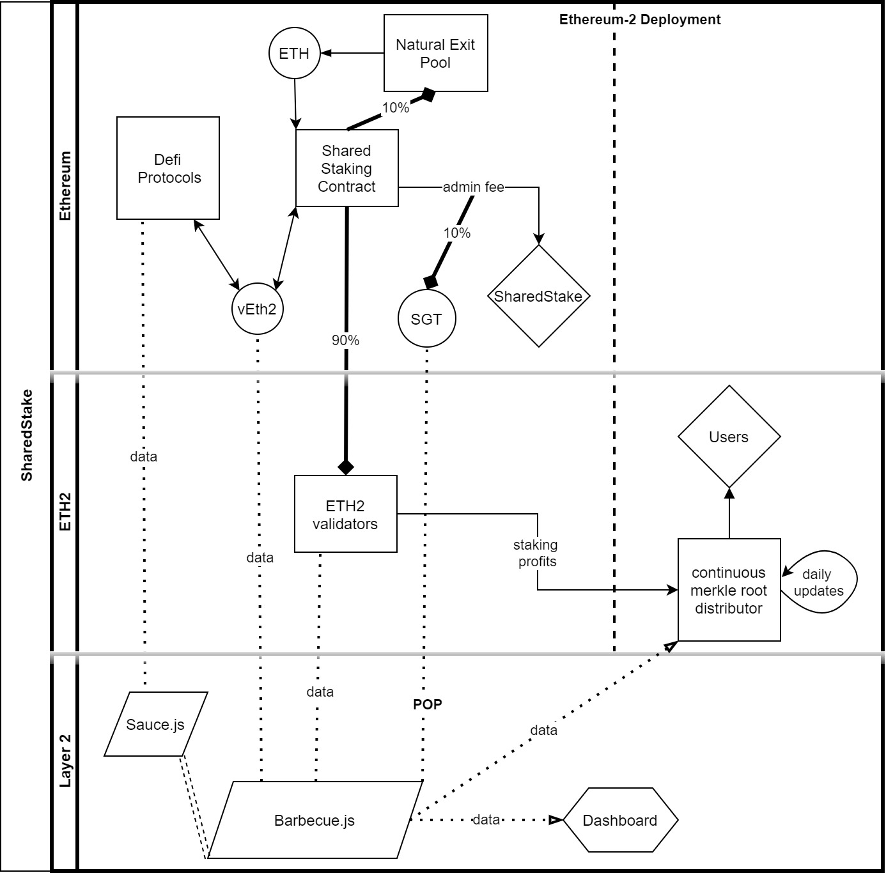

# Simple Summary

<!--"If you can't explain it simply, you don't understand it well enough." Simply describe the outcome the proposed changes intends to achieve. This should be non-technical and accessible to a casual community member.-->
Explain the vEth2 profit distribution process detailedly. 

# Abstract

<!--A short (~200 word) description of the proposed change, the abstract should clearly describe the proposed change. This is what *will* be done if the SIP is implemented, not *why* it should be done or *how* it will be done. If the SIP proposes deploying a new contract, write, "we propose to deploy a new contract that will do x".-->
At the moment, vEth2 is like any other Eth2 derivative token. This will change to an "off-chain yield bearing wrapped ether" which is being used for the distribution of Eth2 staking profits of SharedStake Protocol. Profits will be calculated with the formula: time*amount, simply, for any address. This calculation will be done by Layer 2 scaling with Barbecue.js. Also, Sauce.js will act as a bridge for Barbecue.js to add support to contracts in the blockchain, which aims to increase the Defi support with "Adaptors". At the end of the day, SharedStake users will gain staking rewards every block, while just holding or investing vEth2 in supported Ethereum Applications such as Uniswap, Sushiswap, Curve, Maker, Compound, Aave and many more... Users will also be able to keep track of their profits with the Dashboard.

# Motivation

<!--This is the problem statement. This is the *why* of the SIP. It should clearly explain *why* the current state of the protocol is inadequate.  It is critical that you explain *why* the change is needed, if the SIP proposes changing how something is calculated, you must address *why* the current calculation is innaccurate or wrong. This is not the place to describe how the SIP will address the issue!-->
## Increased Defi Compitability
- By using vEth2, instead of any other kind of wrapped Ether, defi users gain extra 9-10% Yearly Growth with off-chain profit distribution.
- Since vEth2 doesn't contain any 'imaginary' staking rewards -which is expected to be appreciated by the community in other protocols- it is a stable token pegged to the value of Ether. Pratically eliminates the impermanent loss.

## Financial Optimization of User Profits
- With the proposed concepts like Natural Exit Pool, Proof-of-Participation, off-chain yield bearing, Provable profit sharing... SharedStake optimizes the Eth2 staking profits by creating a secure off-chain yield distribution mechanism.
- On top of the Ethereum-2 Staking profits, vEth2 and its usage on other Decentralized Finance Applications are incentivized further with SGT, which is used as a Token for Proof of Participation in the SharedStake Protocol.
- Proof of participation will eliminate a small group of people from taking stakers' profits. Currently, it is 0, which means you don't need to own any SGT to prove you are indeed aiming to stake your Ether with SharedStake. This value can change in the future, at which point enough SGT is allocated to vEth2 holders through [community allocations](https://docs.sharedstake.org/sgt/distribution-and-emission). 
- A portion of Admin fee will be used for buyback of SGT to be put in the treasury, which already contains the [24% of the total supply](https://docs.sharedstake.org/sgt/tokenomics).

## Increased User Experience
- Ethereum2 profits will be distributed when Eth2 is launched, but it can be tracked and analyzed with the dashboard. Dashboard allows users to see their Eth2 staking profits with important parameters. Users can also keep track of the overall statistics of the Protocol.

## Decreased risks
- vEth2 doesn't include any imaginary profits.
- It's value pegged to Ether with a natural exit pool, which means Liquidity Providers and traders don't need to worry about fluctuations on pricing.

## Sustainability
- SharedStake founders planned to decentralize all staking process with the Eth2 deployment. After that, vEth2 will become an on-chain yield bearing wrapped Ether with on-chain calculations.

# Specification

## Overview

<!--This is a high level overview of *how* the SIP will solve the problem. The overview should clearly describe how the new feature will be implemented.-->
This proposal emphasizes 3 important point: Layer 2 scaling with Barbecue.js and Sauce.js, Introduction to the Concept of Proof of Participation, Improvements on SGT and vEth2 tokenomics. 

## Rationale

<!--This is where you explain the reasoning behind how you propose to solve the problem. Why did you propose to implement the change in this way, what were the considerations and trade-offs. The rationale fleshes out what motivated the design and why particular design decisions were made. It should describe alternate designs that were considered and related work. The rationale may also provide evidence of consensus within the community, and should discuss important objections or concerns raised during discussion.-->
In the changing ecosystem of Ethereum, Proof of Stake will be the new consensus mechanism. There are few attempts by the other protocols to create such a staking mechanisms to solve the liquidity problem on Eth2 Staking. However, none of them has enough rationale to support the usage of their protocol on Decentralized Finance, since other versions of wrapped Ether includes an "imaginary" yield which is expected to be appreciated by the community. This issue eliminates the Eth2 staking profits until Ethereum2 Deployment while creating a possible loss of funds in the short run, and Impermanent Loss in the long run. As a solution, we propose an off-chain profit distribution by creating a stable token, backed by a "Built-In Exit Pool". Staking mechanism also has better incentivization and improved user experience with dashboard for any user, from tech degens to new-comers.

## Technical Specification

<!--The technical specification should outline the public API of the changes proposed. That is, changes to any of the interfaces SharedStake Finance currently exposes or the creations of new ones.-->
Proposed Implementation is described in the figure below:

### Provable profit sharing: 
- Anyone can calculate the profits and compare it with our calculations. 
- By using and reviewing the open source mechanism, anyone can approve it or improve it. 

### Barbecue.js:
- Stores and analyzes the [events emitted from vEth2 Contract](https://etherscan.io/address/0x898bad2774eb97cf6b94605677f43b41871410b1#events). 
- Takes an address as an input and calculates it's contribution to the Eth2 staking on SharedStake Protocol every single block. Then stores it and acts as an api endpoint. 
- A proposed calculation with just "held amount of vEth2", will not support the profits coming from vEth2 stored in various contracts; So, we fix  this issue and add a support to the personal or protocol contracts with sauce.js.
- Uses SGT as a Proof of Participation to eliminate outsiders and distributes the profits of vEth2 invested in supported Contract and Protocols, to the **users of SharedStake**. 

### Sauce.js:
- Includes various adaptors for different type of contracts.
- It is open to contribution, which means any Decentralized Protocol or a community member can include their "Adaptor" and "Address" to be included in the profit sharing mechanism.
- [Example Adaptor model ↗](https://github.com/ConcourseOpen/DeFi-Pulse-Adapters)

### Dashboard:
- Dashboard allows users to see their Eth2 staking profits with important parameters taken from Barbecue.js . Users can also keep track of the overall statistics of the Protocol.
- Currently Dashboard is under construction and planned to be active on April-May 2021.

### Proof of Participation:
- Off-chain profit sharing comes with a problem when you support various defi protocols: you don't know who invested the vEth2 stored in the contracts, pools, geysers... We use SGT to decide who is coming from SharedStake and who to distribute the Eth2 staking profits. 
- While vEth2 amount is a part of the calculations, SGT amount doesn't affect the received profits.
- Since using an unstable token as a POP can result in unstability of overall protocol structure, and this issue is not active while the marketcap of vEth2 is too small to use in decentralized finance; **It is proposed to activate the POP mechanism after surpassing the 1000 validator in total.**
- Pop structure contains a min-pop, max-pop and threshold for everyblock.

## Configurable Values

### POP: Proof of Participation
- min-pop = 0 : minimum amount of SGT that is accounted by addresses that will be included in the calculation of threshold value. Anyone lower than min-pop will be excluded as default. Proposed to be changed after 1000 validators.
- max-pop = 0 : maximum amount of SGT that is accounted by addresses that will be included in the calculation of threshold value. Anyone with amount more than max-pop will be included as default. Proposed to be changed after 1000 validators.
- threshold = 90% : threshold between min and max values that leaves outsiders out of the calculation of POP value. Lets say min=1 and max=16, 90% of the addresses holding an SGT in this range will be included to reward distribution. Threshold acts as a balancer mechanism for SharedStake: When more people is leaving the protocol threshold is lower, which increases the number of address that receives Eth2 staking profits and reduces the cost of investment; Increasing the profitability of the protocol as a result. Which is expected to increase the number of newcomers, creating a negatif feed-back. vice-versa.  

### Barbecue.js:
- genesis = 11426200 : first block to store events.  
- POP value: Calculated by Proof of Participation mechanism.

### Sauce.js:
- adaptors: defines the profit distribution mechanisms for a protocol as an algorithm. Any contract can be supported with a correct adaptor. 
- genesis : changes for every adaptor.
- addresses : every address is categorized under an adaptor. Every address has a genesis which should be more than it's adaptor's.

## Concerns

- There might be some concerns about POP mechanism. With the correct parametres and SIPs on changing them when its needed, we can reduce the concerns about the process. Also, currently, it is 0, which means you don't need to own any SGT to prove you are indeed aiming to stake your Ether with SharedStake. This value can change in the future, at which point enough SGT is allocated to vEth2 holders through [community allocations](https://docs.sharedstake.org/sgt/distribution-and-emission).

- There might be some concerns about the usage of admin-fee. Admin fee is actually receieved when people are withdrawing their staked Ether. So, it doesn't contain any risk. But any SIP can propose to change the admin-fee as well as disabling the withdrawals etc. It will act as an exit fee when the refund is disabled. After a while, withdraw fee refunds can be available again with an another SIP.

## Copyright

Copyright and related rights waived via [CC0](https://creativecommons.org/publicdomain/zero/1.0/).